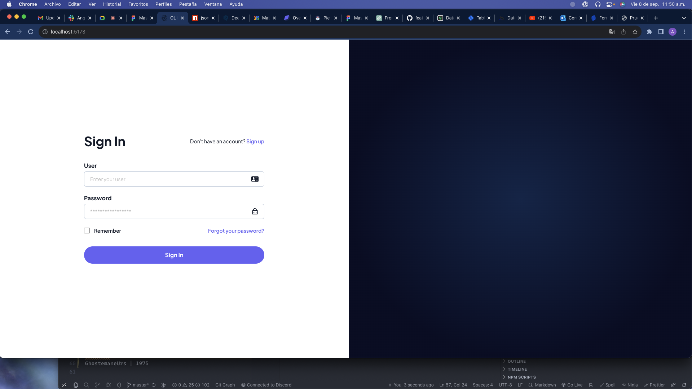
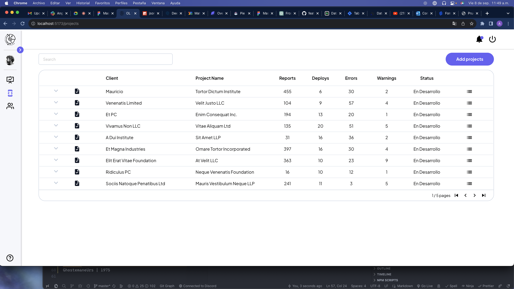

# OL SOFTWARE TEST

The following technologies have been implemented to meet the requested requirements: ViteJS, ReactJS, TailwindCSS, SASS, Json Server, Redux. All of these played a significant role in the development of this test, allowing us to fulfill the requirements and showcase my skills as a FrontEnd developer.

## Features

- **ViteJs:** It has been used to encapsulate our React project. Vite is a tool created by Evan You, the creator of VueJs, which allows us to create projects without tying them to a specific framework.

- **ReactJS:** It was used to build the website interactively and responsively.

- **TailwindCSS:** It allowed me to style the project, providing a wide range of classes that I could use.

- **JSON Server:** It allowed me to implement the fake API, providing me with the ease of simulating responses on the frontend.

- **Redux Toolkit:** It allowed me to make requests to my fake API, thus allowing me to use its responses anywhere in the project.

- **Hot - Toas - Notifications:** It allowed me to create notifications for the fake API in the project.

- **ChartJs and React ChartJs:** It allowed me to implement the charts in the project, making it possible to visually display the data.

- **Formik and Yup:** It allowed me to implement forms in the project, thus validating the data visually.

## Project Installation

- [NodeJS](https://nodejs.org/) v10+ is required.
- [Git](https://git-scm.com/) is required.
- Clone the repository using the `git clone` command.

## Guide to initialize the project

    ```sh
    cd ol-software
    npm install to install all the necessary dependencies
    npm run dev to start the project in ViteJS 😎
    npm run server to start our fake API with JSON Server 💪
    ```

## Documentation of implemented technologies

-  [Vite](https://vitejs.dev/)
-  [ReactJs](https://es.reactjs.org/)
-  [Tailwindcss](https://tailwindcss.com/docs)
-  [JSON Server](https://github.com/typicode/json-server)
-  [Redux Toolkit](https://redux-toolkit.js.org/)
- [Hot - Toas - Notifications](https://react-hot-toast.com/)
-  [ChartJs](https://www.chartjs.org/docs/latest/)
- [Formik](https://formik.org/)

## Changes in project requirements

* Changes have been made to the proposed design:
    - Developers must be displayed in the projects table in list form. To achieve this, I have implemented a table that can be used as an accordion, making the most important information visible to the operator without limiting their view of the developers in the project.

## Previsualización de algunas pages del proyecto




## Autor
GhostemaneUrs | 1975